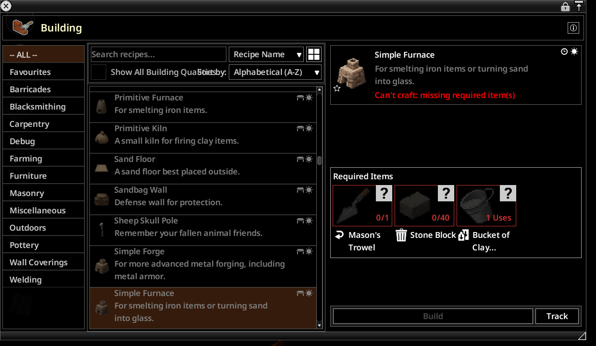
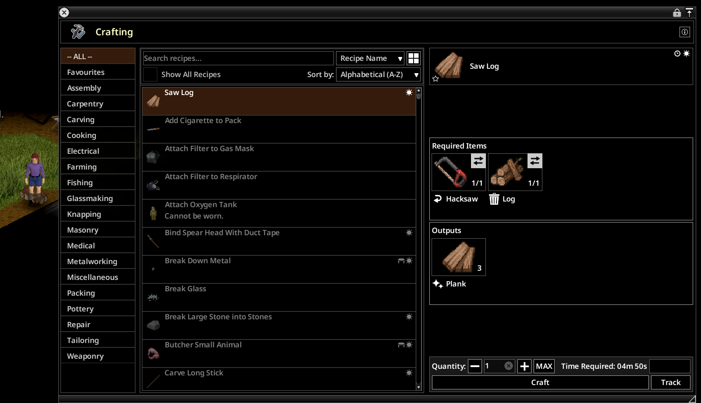
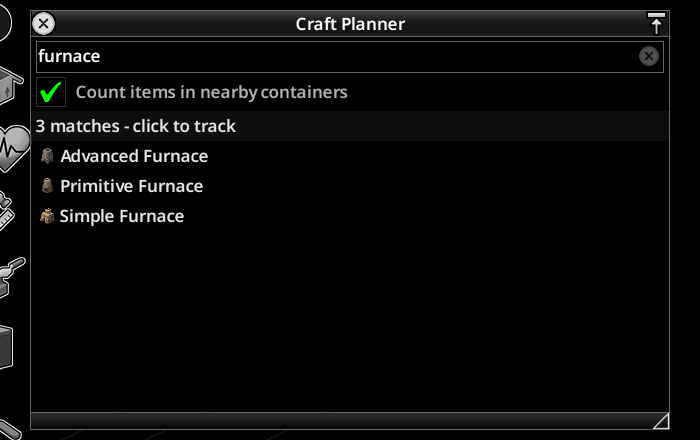
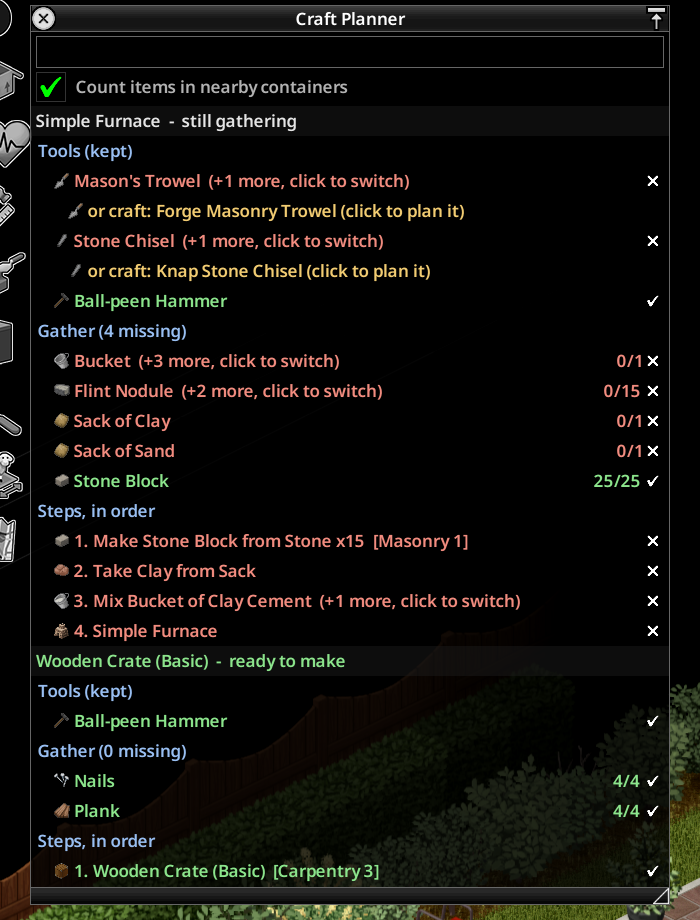

# How to use Craft Planner

## 1. Pick a goal
There are three ways to start tracking something:

- **From the crafting or build window.** Select a recipe and hit **Track** next to Craft / Build.

  

  

- **From the planner.** Press **K** and type what you want to make, then click it.

  

- **From an item.** Right-click it and choose **Track how to make ...**.

You can track as many goals as you like. Each gets its own plan.

## 2. Read the plan

| Section | What it tells you |
|---|---|
| **Tools (kept)** | What you need to hold, like a saw, hammer, or trowel. One is enough, and none of them get used up. If you have none, the planner picks one you can make and adds it to Steps. |
| **Gather (N missing)** | Raw materials and fluids, shown as have/need. Missing ones sit at the top. |
| **Steps, in order** | Every craft from the bottom of the chain up, ending with your goal. |

Step colors:
- **Green tick:** ready now.
- **Amber, "after earlier steps":** you'll have the inputs once the steps above it are done.
- **Red cross:** blocked until you gather something.

## 3. Go get it
The plan refreshes every second. Pick things up and the ticks fill in. Crafting a sub-step removes it from the plan, and making the goal clears the whole thing with a "Made X" pop-up.

## Smart bits
- **It uses what you have first.** Items in your bag and in nearby containers are spent before anything is added to Gather. Untick *Count items in nearby containers* to count only what you're carrying.
- **Quantities scale.** Need 4 planks at 3 planks per log? The plan says 2 logs.
- **Leftovers carry.** Extra output from one batch feeds later steps.
- **Alternatives.** Anything marked **+N more, click to switch** can be clicked to cycle through them: nails vs screws, a different saw, or a different recipe for the same item.
- **Skills and recipes.** Steps that need a skill level you don't have, or a recipe you haven't learned, say so.

## Controls
| Action | How |
|---|---|
| Show / hide the planner | **K** (rebind in Options > Mods > Craft Planner) |
| Stop tracking a goal | Right-click its header |
| Keep goals after making them | Untick *Stop tracking a recipe once you craft or build it* in Mod Options |

## Limits
- Fluids are counted in containers you carry or that are nearby. Rain barrels, sinks, and other world sources aren't counted.
- "Any fluid" inputs show the amount without a tick.

## Troubleshooting
If something goes wrong, open an issue with the last 50 lines of `Zomboid/console.txt`:
https://github.com/HxHippy/pz-craft-planner/issues
