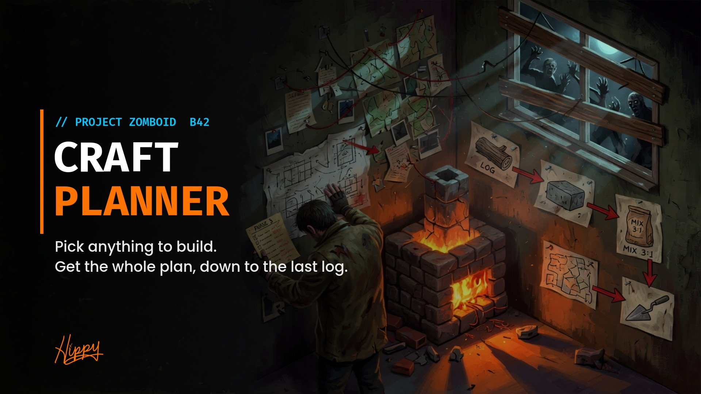

# Craft Planner



**Pick anything to build. Get the whole plan.**

**[How to use it](GUIDE.md)** | **[Steam Workshop](https://steamcommunity.com/sharedfiles/filedetails/?id=3808092704)** | **[Issues](https://github.com/HxHippy/pz-craft-planner/issues)**

Craft Planner is a Project Zomboid **Build 42** mod. Pick something to build and it gives you a live plan: the tools you need, what to go gather, and every craft in the order you do them, all the way down the chain.

## Start a plan
- Hit **Track** next to Craft / Build in the crafting and build windows. With Neat Crafting it's the clipboard icon on the recipe icon, and it turns green once tracked.
- Press **K** (rebindable in Mod Options) and search for anything.
- Right-click an item and choose **Track how to make X**.

## The plan
Each tracked goal shows three sections:

| Section | What's in it |
|---|---|
| **Tools (kept)** | Trowel, saw, hammer, and so on. You need one of each, and none of them get used up. If you have none, the plan picks the one you can craft and adds it to Steps. |
| **Gather (N missing)** | Raw materials and fluids as have/need. Missing ones sort to the top. |
| **Steps, in order** | Crafts bottom-up, ending with the goal. Each one is marked ready, after earlier steps, or blocked on gathering. |

The planner spends what you already have first. That includes nearby containers when the tickbox is on, which is the default. Only real shortfalls turn into sub-crafts, quantities scale with recipe yield, and leftovers from one batch feed later steps.

Anything marked **+N more, click to switch** can be clicked to cycle through its alternatives (a different saw, nails vs screws, a different recipe).

Making the goal clears it from the planner, and Mod Options can turn that off. Right-click a goal's header to stop tracking it. Plans are saved on your character.

## Multiplayer
Craft Planner is client-side only. It reads recipe scripts and your own containers and changes nothing in the world.

## Install
- **[Workshop](https://steamcommunity.com/sharedfiles/filedetails/?id=3808092704):** subscribe, then enable **Craft Planner** in Mods.
- **Manual:** copy this folder to `~/Zomboid/Workshop/CraftPlanner` and enable it in Mods.
- **Dedicated server:** add `3808092704` to `WorkshopItems=` and `CraftPlanner` to `Mods=`.

## Limits
- Fluid counts cover containers you carry or that are nearby. World sources such as rain barrels and sinks aren't counted.
- "Any fluid" inputs show the amount without a check.

## Layout
```
Contents/mods/CraftPlanner/
  common/
  42/
    mod.info, poster.png, icon.png
    media/lua/client/CraftPlanner/
      CraftPlanner_Graph.lua    recipe index, search, counting
      CraftPlanner_Plan.lua     the planner
      CraftPlanner_Window.lua   planner window
      CraftPlanner_Buttons.lua  Track button in crafting/build windows
      CraftPlanner_NeatCompat.lua  Track icon in Neat Crafting's recipe panel
      CraftPlanner_Main.lua     state, hotkey, auto-clear
    media/lua/shared/Translate/EN/UI.json
    media/ui/CraftPlanner/Icon_Track.png
```

## License
MIT

---
Made by **HxHippy**. Built by Kief Studio, powered by LTFI.
